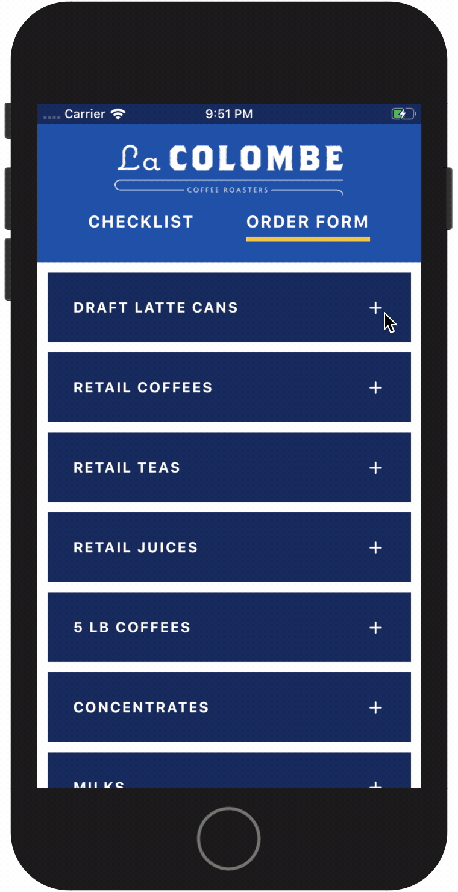

  

# Restock

> A mobile application for quickly and easily replenishing inventory

## Demo

  

## Motivation

This project was born out of the following 3 desires:

1. The desire to explore the differences between React and React Native
2. The desire to see what building an application for mobile is like
3. The desire to not have to make a new note on my phone every time I needed to restock something at work

## What I Learned

Building this project taught me a lot about React Native and the ways in which it differs from React.

The most obvious, and immediately visible, difference was that React Native uses native components instead of
HTML elements. I was able to work with a handful of React Native's built-in components (such as `Button`, `Text`,
`View`, `ScrollView`, and `SafeAreaView`) and learn about their props.

Another interesting difference was the way in which layout considerations shift in React Native to accomodate
for the dimensions of mobile screens. I ended up noticing this shift a lot when working with layout-related CSS
properties, some of which were either missing values I was used to seeing (such as `display: inline` or `display: block`)
or had the opposite default value of their React counterparts (`flex-direction: column` vs. `flex-direction: row`).

Some other cool things I learned while building this project:

- How to set up screens and navigate between them using React Navigation's `createStackNavigator` API
- How to use styled-components 💅 (working with the `styled` API, adapting styles based on props)
- How to set up and work with tools like Xcode's iOS device simulator and the Expo Client app to preview changes
  and test functionality in real-time
- Honestly, it would behoove me to write tests sooner, and to really think through whether or not the data
  structure I have in mind is going to be effective 😅

## Built With

- [`React Native`](https://github.com/facebook/react-native)
- [`Expo`](https://github.com/expo/expo)
- [`React Navigation`](https://github.com/react-navigation/react-navigation)
- [`Styled Components`](https://github.com/styled-components/styled-components)
